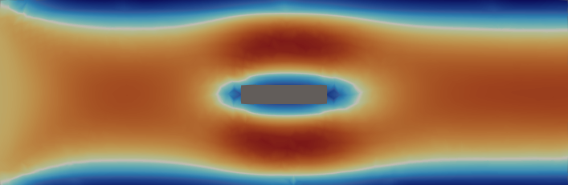
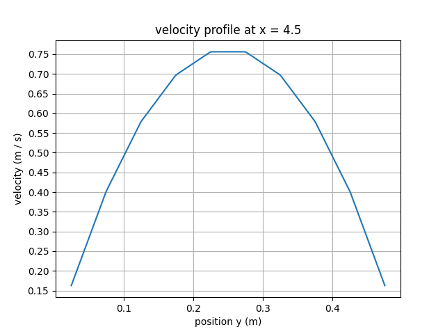

# CFDeez
CFDeez is a 2D finite-volume computational fluid dynamics (CFD) application and library,
developed entirely from scratch. While primarily created as a learning tool, it can also serve as a helpful resource
for those interested in CFD.

> [!WARNING]
> Under active development, bugs to be expected.

<p align="center">
  
  <p align="center"><i>Velocity profile around an object.</i></p>
</p>

## Motivations
CFD has a reputation of being difficult. So the goal was to see if 2 univeristy students with big egos but no real understanding
of anything could pull it off. Development is still underway so our egos are in a superposition of being massive and also
heavily bruised.

## Quickstart
To get started with CFDeez, you’ll need the [Odin](https://odin-lang.org/) compiler installed, as no pre-built binaries will be provided for early versions.

```bash
# Clone the repository
git clone https://github.com/Rwn-A/cfdeez
cd cfdeez

# Build the CLI tool (optimizations really help)
odin build src/app/cli -out:cfdeez.exe -o:speed 
# add -define:LOG_LINSOLVE_PROGRESS=true to see how the linear solvers are progressing if you run into non-convergence.

# Run a basic example
./cfdeez.exe ./example/00_basic.fml
```

After this results will be saved to a `.out` directory located beside your executable.

> [!TIP]
>This documentation covers using cfdeez as a complete application.
>If you're interested in using the CFD library or the FML configuration system on their own,
>best to read the code for the cfd library, there is a separate README for FML.

## Features and Limitations
CFDeez is not designed as production CFD software. It is CPU only.
While we might add GPU processing, it is not a guarantee and outside the scope of this project for now.
The primary goal of this project is to understand how CFD works, and write readable code that represents the physics. Specific
discretization schemes are currently not configurable.

Features:
- ✅ 2D incompressible flow 
- ✅ 2D transport
- ✅ Unstructured meshes
- ✅ Transient and steady-state
- ✅ Output to VTU and CSV
- ✅ Configurable

Currently, we have no 1st party post-processing tools, best bet is to use VTK output option and use something like
[ParaView](https://www.paraview.org/), or pyvista with python. You can also output to CSV and write a custom visualization.

### Potential Features Under Consideration
In no particular order, the below features are things we are interested in but have no current plans to attempt to implement.
- Turbulence Modelling
- 3D
- 1st Party Mesh Generation
- Compressible Flow
- Configurable schemes
- Native GUI application

## Setup & Configuration
The best way to learn the configuration options is to review the examples directory.
Each example is numbered in order of complexity. There are also some prebuilt `.msh` files available.

### Writing your own config
A configuration consists of two parts.
1. `.fml` file - Most of the configuration options are here, this is the file you pass to the executable.
2. `.msh` file - this defines the mesh for your simulation, the path to this file is referenced in the main config file.

To build a `.msh` file [gmsh](https://gmsh.info/) is required. Or you can convert from another format using something like
[meshio](https://github.com/nschloe/meshio).

> [!IMPORTANT]
> Incompressible flow uses unit density, scalar transport uses supplied density. 
> This means pressure values are not completely accurate unless scaled. We currently do not do this scaling.

> [!NOTE]
> Only version 2.2 of the `.msh` format is supported for now.

### Config Options
> [!NOTE]
> Comprehensive overview of all options will be held off until options mature.

## Project Structure
CFDeez is comprised of 3 components.
1. CFD Library `/src/cfd`
    - The core cfd code is its own library, it includes code for the fields, discretizations, linear systems and more
    - Includes optional sub-packages for outputting fields, reading `.msh` files, and pre-built solver algorithms.
2. Configuration Language `/src/fml`
    - CFDeez uses a custom JSON esque configuration language called FML, FML can be used standalone
    although I can't think of many use cases outside of this application.
3. Application Interface `/src/app`
    - The configuration language and CFD library are wrapped together into a single
      executable with a predefined configuration schema.

## Accuracy
This is an engineering simulation in spirit so we have tried to use accurate methods. That being said, most discretizations are only first-order accurate, but implicit for stability.
Higher order methods may be implemented in the future.

## Validation
So far, we have only verified laminar channel flow, backward-facing step also passed the eye-test.

### Low Re Channel Flow
We expect fully developed flow to be about 1.5 times the inlet velocity at most, and parabolic about the y-axis, below is the graph generated by running the `channel_flow.py` script in the validation directory.
<p align="center">
  
</p>
Although the magnitude is slightly above the theoretical, it is pretty close and the shape is also correct.

## License
The CFD library and application code are licensed under the **GPLv3** license.
The FML configuration language is licensed separately under the **MIT** license.

## Contributing
Any and all contributions welcome, that does **not** mean any and all contributions will be accepted.

## References
- [1] H. K. Versteeg and W. Malalasekera, *An Introduction to Computational Fluid Dynamics: The Finite Volume Method*, 2nd ed. Harlow, England: Pearson Education, 2007.

- [2] J. H. Ferziger, M. Perić, and R. L. Street, *Computational Methods for Fluid Dynamics*, 4th ed. Cham, Switzerland: Springer, 2020.

- [3] "CFD Direct," CFD Direct Documentation, Accessed: Apr 18, 2025. [Online]. Available: https://doc.cfd.direct/

- [4] "OpenFOAM – Official home of The Open Source CFD Toolbox," OpenFOAM Foundation, Accessed: Jun. 18, 2025. [Online]. Available: https://openfoam.org/

- [5] Fluid Mechanics 101, *YouTube*, [Online]. Available: https://www.youtube.com/@fluidmechanics101


    
